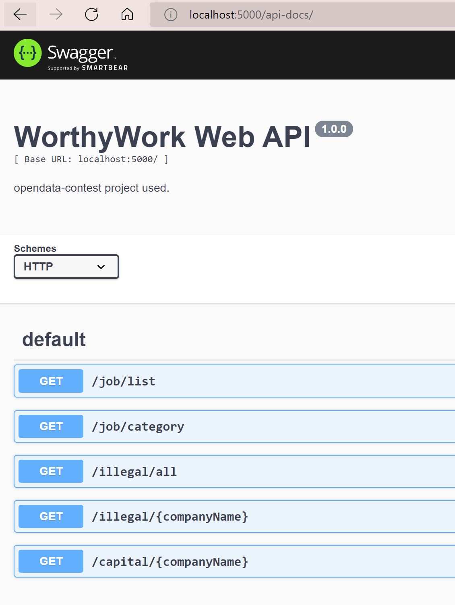

[](https://opendata-contest.tca.org.tw/)
# 資料創新應用競賽作品
- 就業多元創新應用組
- 參賽編號: OD-16040149	
- 產品或服務名稱: WorthyWork─智能工作推薦暨比較平台
## API Document
Use `/api-docs` route to visit Swagger API Docs Page.
[](http://localhost:5000/api-docs/)
## Installation

Initialize front-end:
```console
$ cd client
$ npm install express
```

Initialize back-end:
```console
$ cd server
$ npm install express
```

## Quick Start

### Start Front-end Server:
```console
$ cd client
$ npm start
```

### Start Back-end Server:
#### Online Mode:
```console
$ cd server
$ npm start
```
#### Offline Mode:
```console
$ cd server
$ npm run dev
```

### Auto-Geneterate Swagger Doc
```console
$ cd server
$ npm run swagger-autogen
```
## People

The original author of WorthyWorkApp is [WorhyWork DevTeam](https://github.com/WorthyWork)

[List of all contributors](https://github.com/WorthyWork/WorthyWorkApp/graphs/contributorss)

## License

  [MIT](LICENSE)
