[](https://opendata-contest.tca.org.tw/)
# 資料創新應用競賽作品
- 就業多元創新應用組
- 參賽編號: OD-16040149	
- 產品或服務名稱: WorthyWork─智能工作推薦暨比較平台
## Demo Video
[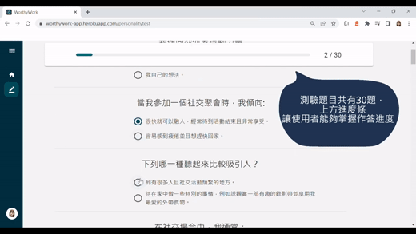](https://www.youtube.com/watch?v=IM-DsE-29v8)
> https://www.youtube.com/watch?v=IM-DsE-29v8
## Screenshots
### 主要頁面
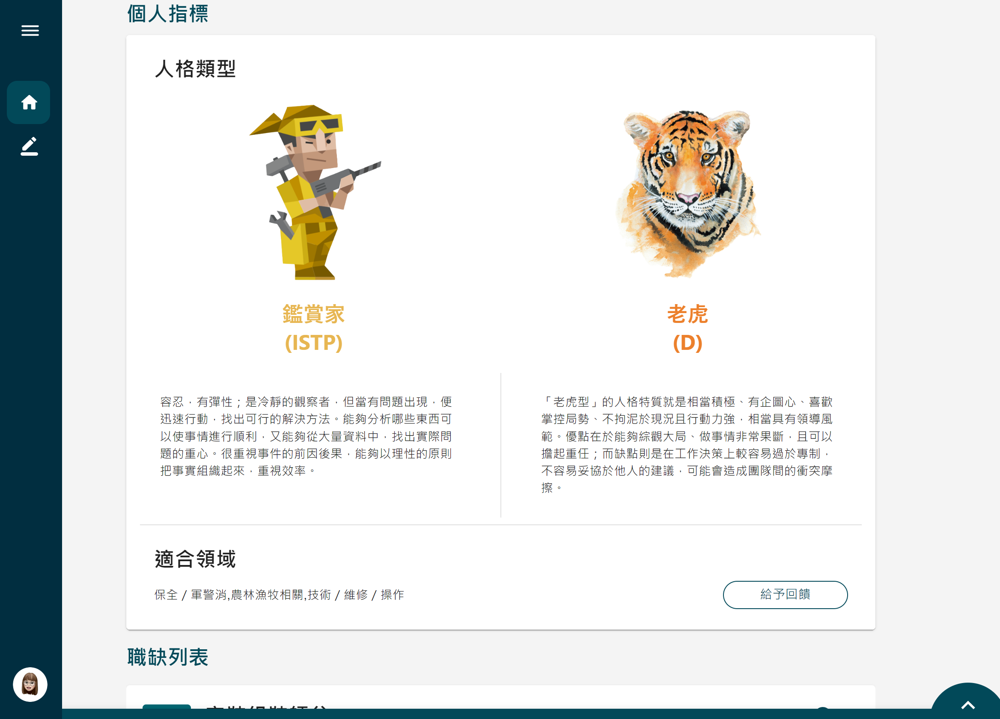
### 使用者回饋頁面
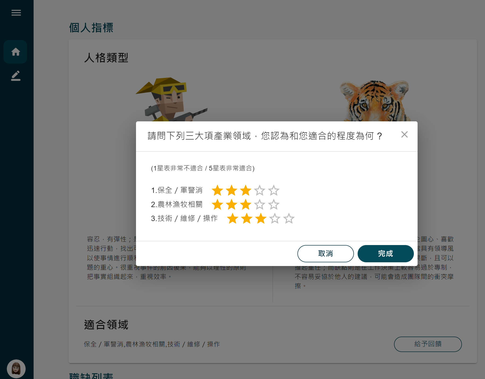
### 測驗頁面
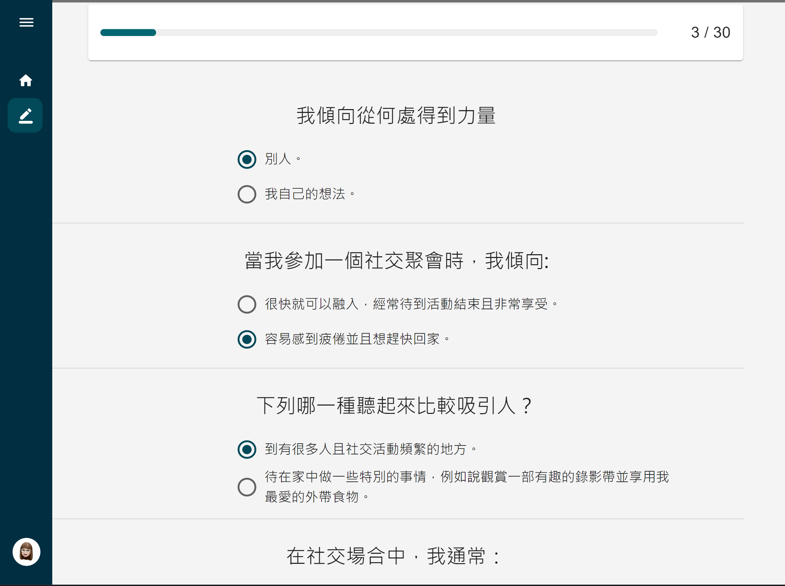
### 職缺列表頁面
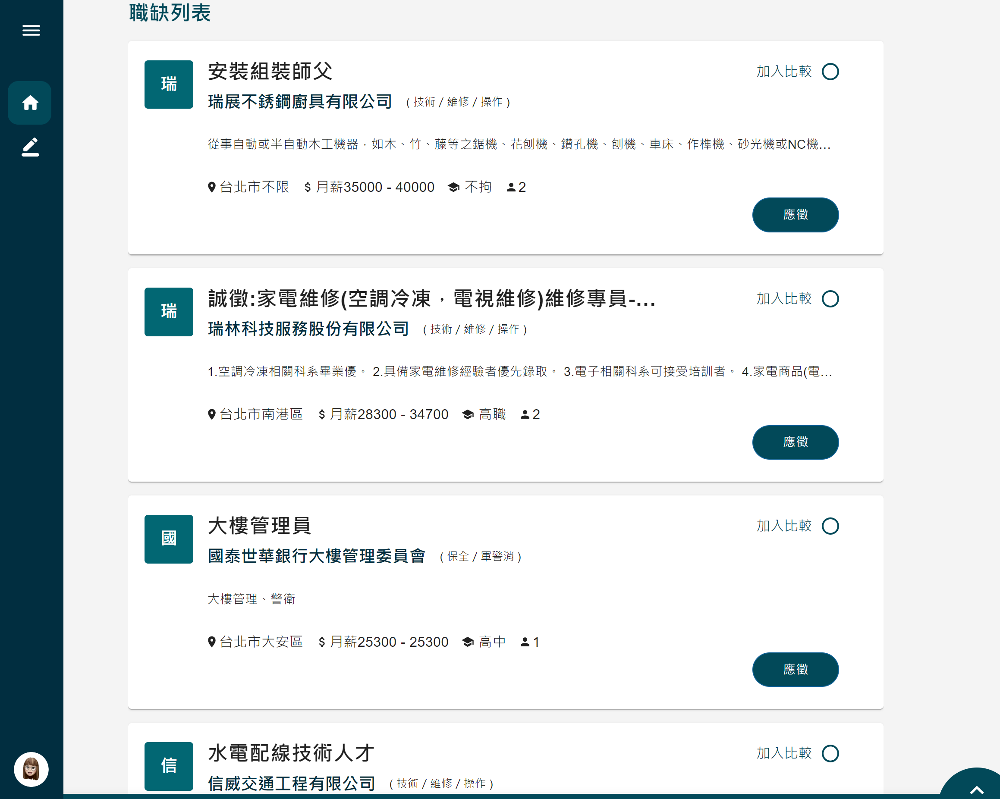
### 加入職缺比較功能
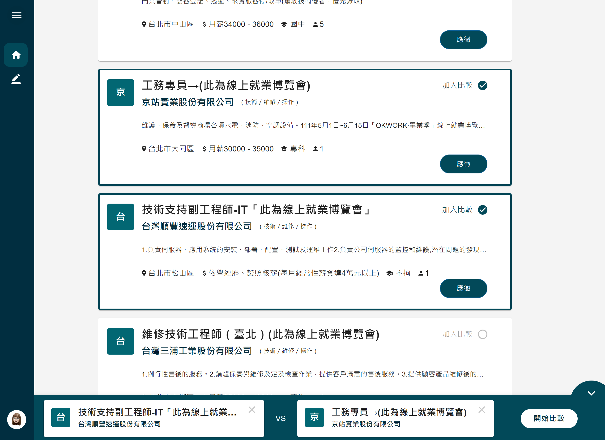
### 職缺比較頁面
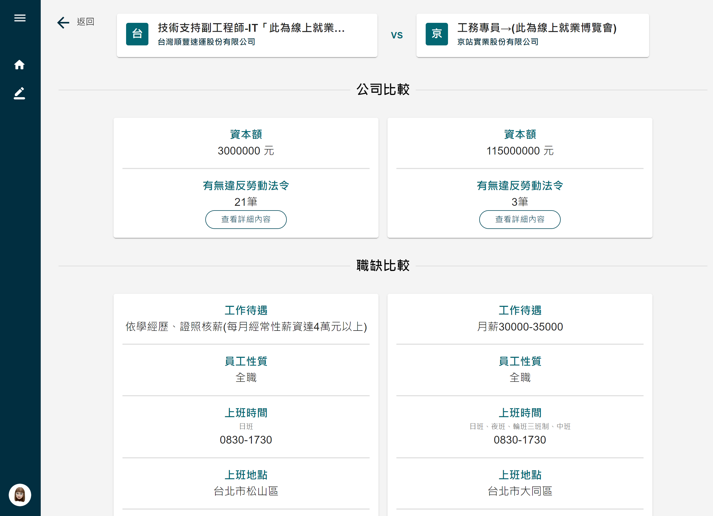
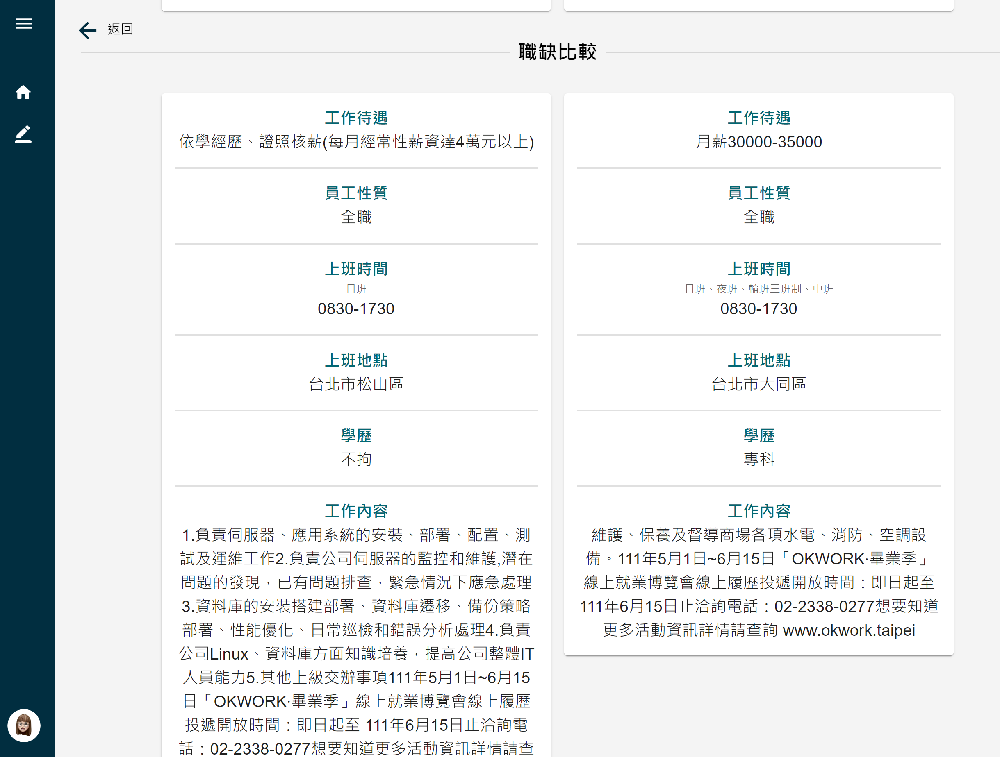
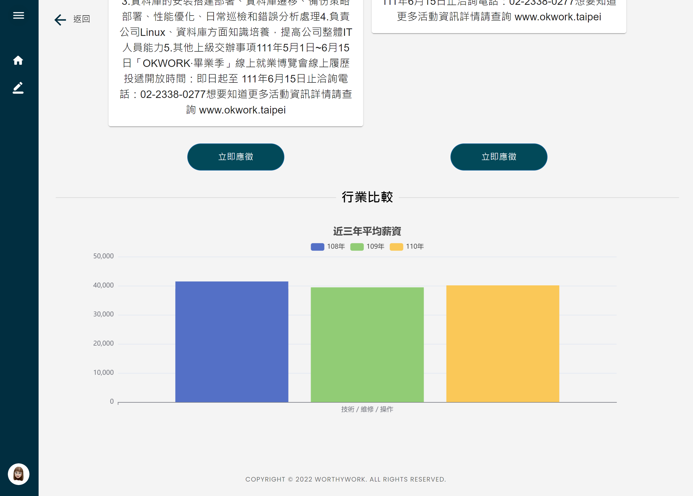
### 違反勞基法頁面
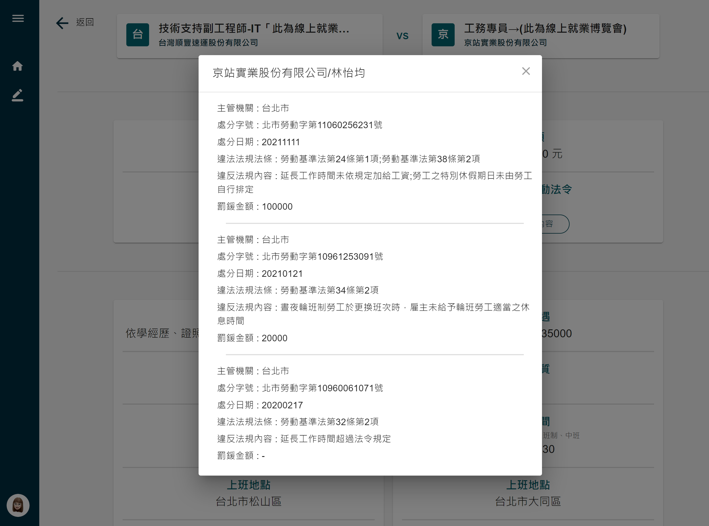
## API Document
Use `/api-docs` route to visit Swagger API Docs Page.
(only in development localhost mode can use)
[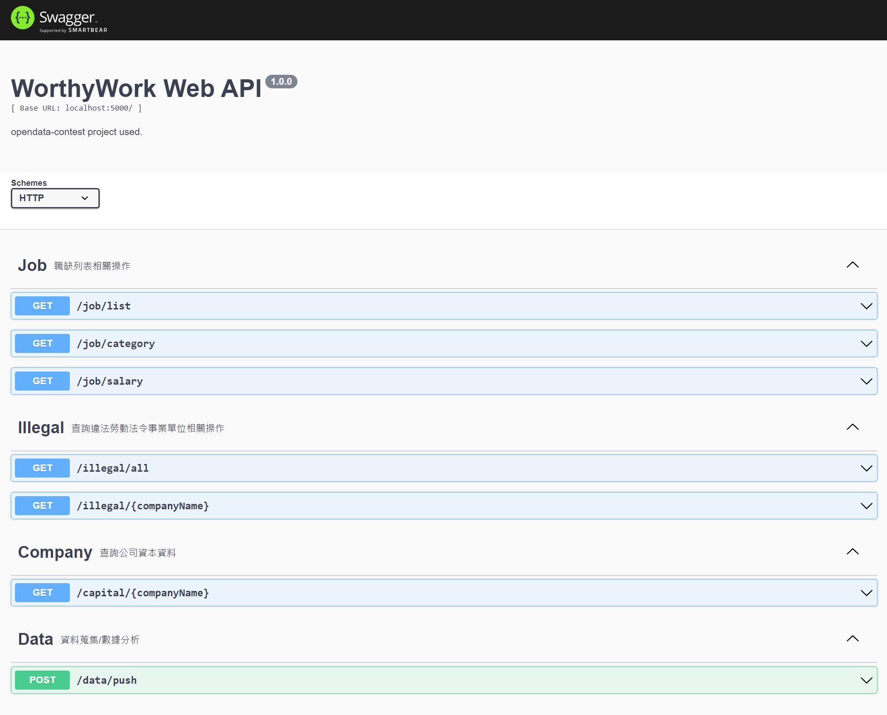]()
## Installation

npm Initialize:
```console
$ npm init
$ npm cd client && npm init
$ npm run init
```

Firestore Initialize:
```console
$ mkdir secret
```
get firebase-adminsdk.json and move to /secret dir

## Quick Start

### Start Front-end & Back-end Server in Development mode:
```console
$ npm run dev
```

### Auto-Geneterate Swagger Doc
```console
$ npm run swagger-autogen
```
## People

The original author of WorthyWorkApp is [WorhyWork DevTeam](https://github.com/WorthyWork)
### WorhyWork DevTeam
- Front-end: [FinnHsu3002](https://github.com/FinnHsu3002)
- Back-end: [msxlol](https://github.com/wutiger555)
## License

  [MIT](LICENSE)
